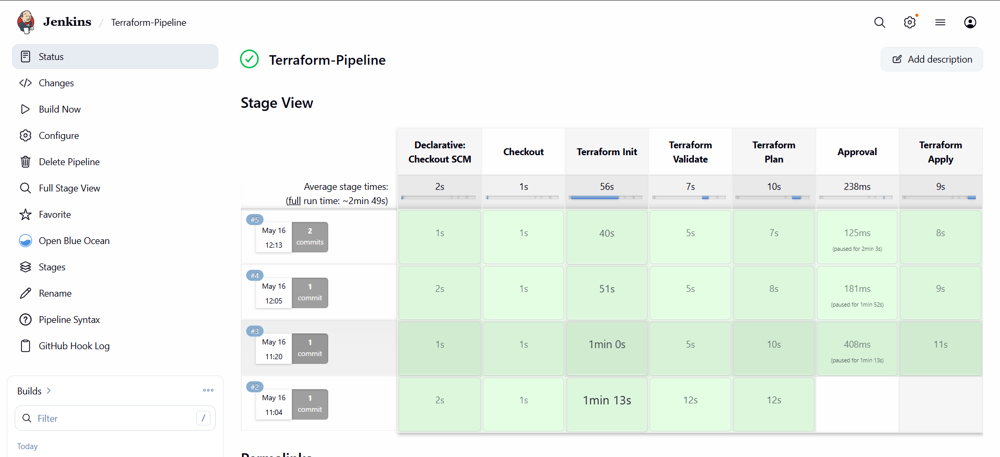
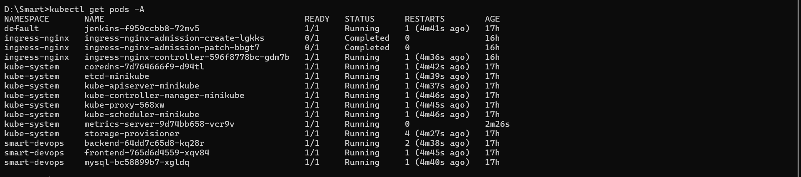
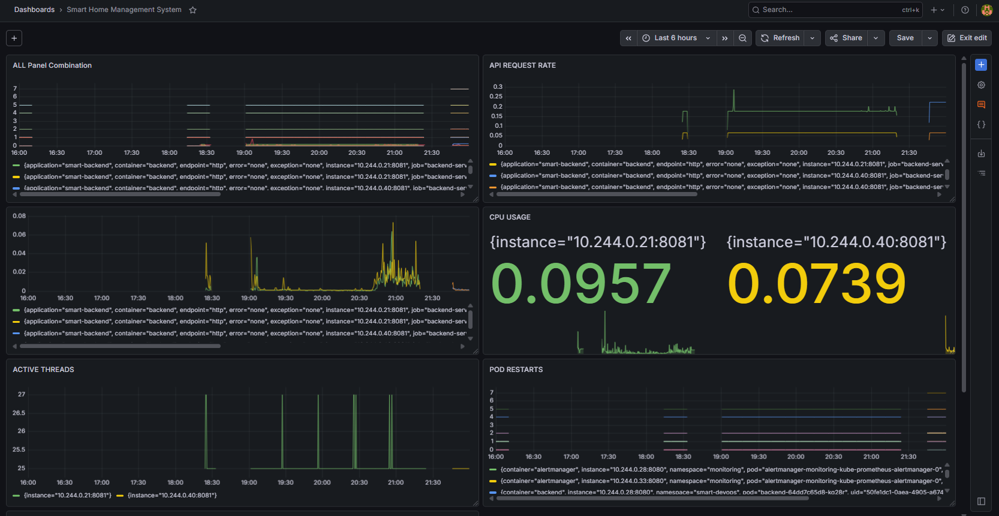
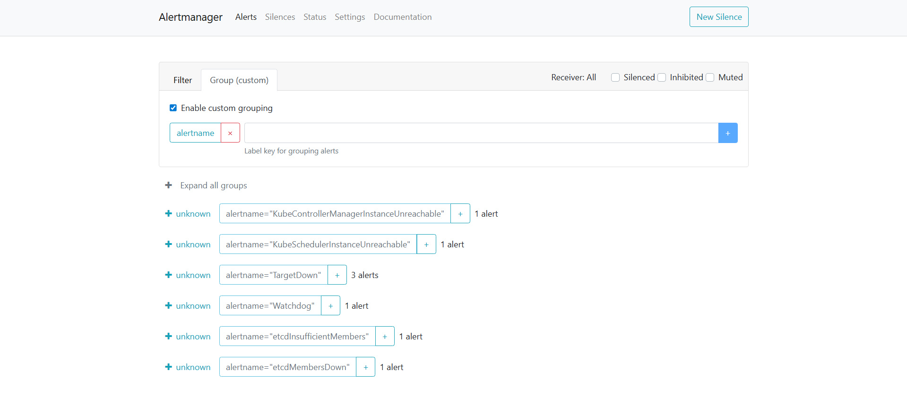
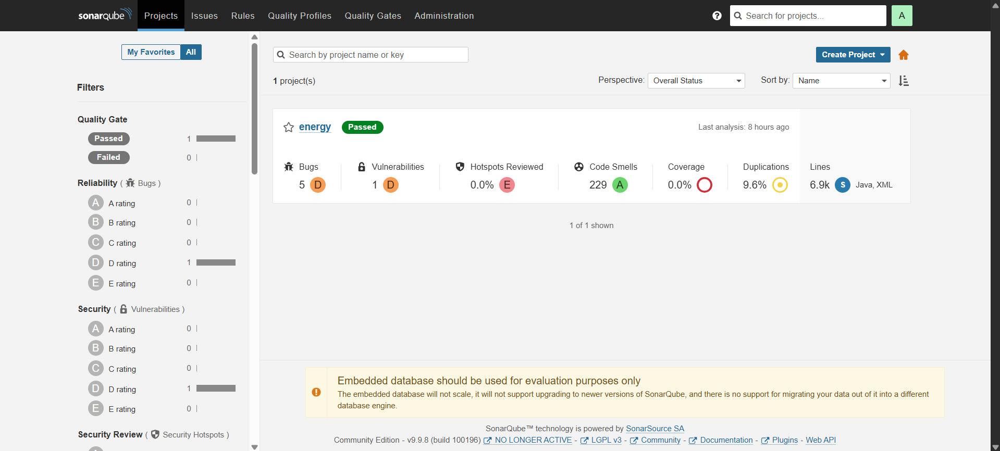
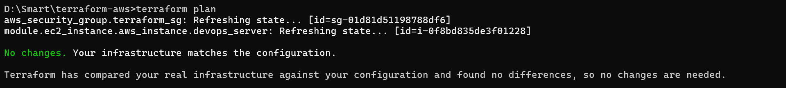
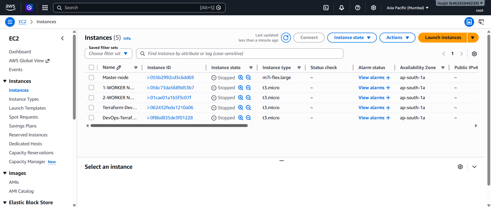

# 🚀 EcoSmart — Cloud-Native Enterprise DevSecOps Platform

A complete end-to-end cloud-native DevSecOps project implementing CI/CD automation, Infrastructure as Code (IaC), Kubernetes orchestration, monitoring, logging, security scanning, and automated deployment pipelines using modern DevOps tools and practices.

---


---

# 🌐 EcoSmart Platform Preview


---

# 📌 Project Overview

EcoSmart is an enterprise-grade Smart Home Energy Management platform designed to simulate a real-world cloud-native DevSecOps ecosystem.

The project demonstrates the complete lifecycle of modern DevSecOps practices including:

- CI/CD automation using Jenkins
- Infrastructure provisioning using Terraform
- Kubernetes orchestration using Minikube
- Docker containerization
- DevSecOps security integration
- Centralized logging and monitoring
- Cloud infrastructure deployment on AWS
- Automated observability stack implementation
- Production-style Kubernetes deployments
- GitHub webhook-triggered automation

The platform was built to replicate enterprise-level DevOps, SRE, Platform Engineering, and DevSecOps workflows.

---

# 📑 Table of Contents

- [Project Overview](#-project-overview)
- [System Architecture](#️-system-architecture)
- [Technology Stack](#️-technology-stack)
- [Key Features](#-key-features)
- [CI/CD Pipeline Workflow](#-cicd-pipeline-workflow)
- [DevSecOps Security Workflow](#-devsecops-security-workflow)
- [Monitoring & Observability](#-monitoring--observability)
- [Centralized Logging](#-centralized-logging)
- [Kubernetes Deployment](#️-kubernetes-deployment)
- [Infrastructure as Code](#️-infrastructure-as-code-terraform--aws)
- [Project Screenshots](#-project-screenshots)
- [Application & Dashboard Access](#-application--dashboard-access)
- [Deployment Guide](#-deployment-guide)
- [Monitoring Setup](#-monitoring-setup)
- [Logging Setup](#-logging-setup)
- [Troubleshooting Guide](#️-troubleshooting-guide)
- [Future Enhancements](#-future-enhancements)
- [Lessons Learned](#-lessons-learned)
- [License](#-license)
- [Author](#-author)

---

# 🏗️ System Architecture

The project follows a complete cloud-native DevSecOps workflow integrating CI/CD automation, Infrastructure as Code, Kubernetes orchestration, security scanning, monitoring, and centralized logging.

---

## 🔄 End-to-End DevSecOps Workflow

```text
Developer → GitHub → Jenkins CI/CD Pipeline → Security Scanning → Docker Build → Terraform Infrastructure → Kubernetes Deployment → Monitoring & Logging
```

---

## 📐 Architecture Diagram

```text
                                ┌────────────────────┐
                                │     Developer      │
                                └─────────┬──────────┘
                                          │
                                          ▼
                                ┌────────────────────┐
                                │      GitHub        │
                                │ Source Code Mgmt   │
                                └─────────┬──────────┘
                                          │ Webhook Trigger
                                          ▼
                                ┌────────────────────┐
                                │      Jenkins       │
                                │    CI/CD Server    │
                                └─────────┬──────────┘
                                          │
              ┌───────────────────────────┼───────────────────────────┐
              │                           │                           │
              ▼                           ▼                           ▼
     ┌────────────────┐        ┌──────────────────┐        ┌─────────────────┐
     │   SonarQube    │        │ OWASP Dependency │        │      Trivy      │
     │ Code Analysis  │        │      Check       │        │ Security Scan   │
     └────────────────┘        └──────────────────┘        └─────────────────┘
                                          │
                                          ▼
                                ┌────────────────────┐
                                │   Docker Build     │
                                │  Containerization  │
                                └─────────┬──────────┘
                                          │
                                          ▼
                                ┌────────────────────┐
                                │     Terraform      │
                                │ Infrastructure IaC │
                                └─────────┬──────────┘
                                          │
                                          ▼
                        ┌────────────────────────────────┐
                        │             AWS                │
                        │ EC2 | S3 | DynamoDB | IAM     │
                        └────────────────────────────────┘
                                          │
                                          ▼
                           ┌─────────────────────────┐
                           │      Kubernetes         │
                           │        Minikube         │
                           └──────────┬──────────────┘
                                      │
         ┌────────────────────────────┼────────────────────────────┐
         │                            │                            │
         ▼                            ▼                            ▼
 ┌───────────────┐         ┌─────────────────┐         ┌─────────────────┐
 │   Frontend    │         │     Backend     │         │      MySQL      │
 │ React + Vite  │         │ Spring Boot API │         │    Database     │
 └───────────────┘         └─────────────────┘         └─────────────────┘
                                      │
                                      ▼
                     ┌────────────────────────────────┐
                     │        Monitoring Stack        │
                     │ Prometheus + Grafana           │
                     │ Alertmanager + Metrics Server  │
                     └────────────────────────────────┘
                                      │
                                      ▼
                     ┌────────────────────────────────┐
                     │         Logging Stack          │
                     │       Loki + Promtail          │
                     └────────────────────────────────┘
```

---

## 🧠 Architecture Highlights

- Fully containerized microservice deployment
- Automated CI/CD pipeline with Jenkins
- Kubernetes-native deployment workflow
- Infrastructure provisioning using Terraform
- Integrated DevSecOps security scanning
- Cloud-native observability stack
- Centralized logging architecture
- AWS remote Terraform backend configuration

---

# 🛠️ Technology Stack

| Category | Technologies |
|---|---|
| Programming Languages | Java, JavaScript |
| Backend Framework | Spring Boot |
| Frontend Framework | React + Vite |
| Build Tools | Maven, npm |
| Containerization | Docker, Docker Compose, NGINX |
| Container Orchestration | Kubernetes, Minikube |
| CI/CD | Jenkins, GitHub Webhooks |
| Infrastructure as Code | Terraform |
| Cloud Provider | AWS |
| AWS Services | EC2, S3, DynamoDB, IAM, Security Groups |
| Monitoring | Prometheus, Grafana, Alertmanager |
| Logging | Loki, Promtail |
| Security | Trivy, SonarQube, OWASP Dependency Check |
| Scaling | HPA, Metrics Server |
| Database | MySQL |
| Networking | NGINX Ingress Controller, Ngrok |
| Project Management | Jira |

---

# ✨ Key Features

## 🚀 CI/CD Automation

- Automated Jenkins pipeline execution
- GitHub webhook-triggered deployments
- Continuous Integration & Continuous Deployment workflow
- Automated Docker image builds
- Automated Kubernetes deployments

---

## ☁️ Infrastructure as Code (IaC)

- Terraform-based AWS infrastructure provisioning
- Remote Terraform state management using S3
- State locking using DynamoDB
- Modular Terraform architecture
- Automated EC2 provisioning

---

## 🐳 Containerization & Orchestration

- Dockerized backend and frontend services
- Kubernetes-based container orchestration
- NGINX Ingress Controller integration
- Kubernetes deployments, services, and ingress management
- Horizontal Pod Autoscaler (HPA) implementation

---

## 🔐 DevSecOps & Security

- SonarQube static code analysis
- Trivy container image vulnerability scanning
- OWASP Dependency Check integration
- Secure secret handling using Kubernetes Secrets
- Automated security scanning in CI/CD pipeline

---

## 📊 Monitoring & Observability

- Prometheus metrics collection
- Grafana dashboard visualization
- Spring Boot Actuator integration
- Loki centralized logging
- Promtail log collection
- Alertmanager alert management
- Kubernetes metrics monitoring

---

# 📁 Project Structure

```text
EcoSmart/
│
├── backend/
├── frontend/
├── kubernetes/
│   ├── backend/
│   ├── frontend/
│   ├── ingress/
│   ├── monitoring/
│   └── mysql/
│
├── terraform/
├── terraform-aws/
│   └── modules/
│       └── ec2/
│
├── docs/
│   ├── architecture/
│   ├── diagrams/
│   ├── monitoring/
│   ├── pipeline/
│   ├── security/
│   ├── setup-guides/
│   └── screenshots/
│
├── Jenkinsfile
├── docker-compose.yml
├── README.md
└── .gitignore
```

---

# 🔄 CI/CD Pipeline Workflow

## 🚀 Pipeline Flow

```text
Developer Pushes Code
        ↓
GitHub Repository
        ↓
GitHub Webhook Trigger
        ↓
Jenkins Pipeline Starts
        ↓
Code Checkout
        ↓
Backend Build (Maven)
        ↓
Frontend Build (npm/vite)
        ↓
SonarQube Code Analysis
        ↓
OWASP Dependency Check
        ↓
Docker Image Build
        ↓
Trivy Security Scan
        ↓
Terraform Infrastructure Provisioning
        ↓
Kubernetes Deployment
        ↓
Monitoring & Logging Integration
```

---

## ⚙️ Jenkins Pipeline Stages

| Stage | Purpose |
|---|---|
| Checkout | Pull latest code from GitHub |
| Backend Build | Build Spring Boot application |
| Frontend Build | Build React/Vite frontend |
| SonarQube Analysis | Static code quality scanning |
| Dependency Check | Dependency vulnerability analysis |
| Docker Build | Build application container images |
| Trivy Scan | Container vulnerability scanning |
| Terraform Init | Initialize Terraform backend |
| Terraform Plan | Infrastructure planning |
| Terraform Apply | Infrastructure provisioning |
| Kubernetes Deploy | Deploy workloads to Kubernetes |
| Monitoring Integration | Prometheus/Grafana monitoring |

---

# 🔐 DevSecOps Security Workflow

## 🛡️ Security Implementations

### 🔎 SonarQube Static Code Analysis
- Code quality inspection
- Bug detection
- Code smell identification
- Security hotspot analysis
- Quality Gate enforcement

### 🚨 OWASP Dependency Check
- Dependency vulnerability analysis
- CVE identification
- Supply chain security scanning
- Vulnerable package detection

### 🐳 Trivy Container Scanning
- Docker image vulnerability scanning
- OS package scanning
- Secret scanning
- Misconfiguration detection

### 🔑 Kubernetes Security
- Kubernetes Secrets for sensitive data
- Namespace isolation
- Secure container deployment practices

---

## 🔄 Shift-Left Security

Security scanning is integrated directly into the CI/CD pipeline before deployment, ensuring vulnerabilities are detected early in the software delivery lifecycle.

---

# 📊 Monitoring & Observability

## 📈 Monitoring Stack

| Tool | Purpose |
|---|---|
| Prometheus | Metrics collection |
| Grafana | Metrics visualization |
| Alertmanager | Alert handling |
| Spring Boot Actuator | Application metrics |
| Micrometer | Prometheus integration |
| kube-state-metrics | Kubernetes metrics |
| Metrics Server | Resource metrics |
| HPA | Autoscaling |

---

## 📉 Grafana Dashboards

Grafana dashboards were created for:

- JVM monitoring
- Kubernetes monitoring
- Application performance metrics
- Resource utilization
- Prometheus targets
- Infrastructure observability

---

# 📝 Centralized Logging

## 📦 Logging Stack

| Tool | Purpose |
|---|---|
| Loki | Log aggregation |
| Promtail | Log collection |
| Grafana | Log visualization |

---

## 🔄 Logging Workflow

```text
Kubernetes Pods
        ↓
Promtail Collects Logs
        ↓
Loki Stores Logs
        ↓
Grafana Visualizes Logs
```

---

# ☸️ Kubernetes Deployment

## 📦 Kubernetes Components

| Resource | Purpose |
|---|---|
| Deployments | Workload management |
| Services | Networking |
| Ingress | External routing |
| ConfigMaps | Configuration |
| Secrets | Sensitive data |
| HPA | Autoscaling |

---

## 🚀 Workloads Deployed

- Frontend Deployment
- Backend Deployment
- MySQL Deployment
- Jenkins Deployment
- Monitoring Stack
- Logging Stack

---

# ☁️ Infrastructure as Code (Terraform + AWS)

## 🏗️ AWS Services Used

| AWS Service | Purpose |
|---|---|
| EC2 | Compute infrastructure |
| S3 | Terraform remote state |
| DynamoDB | State locking |
| IAM | Access management |
| Security Groups | Network security |

---

## 📦 Terraform Features

- Remote state backend
- State locking
- EC2 provisioning
- Dynamic security groups
- Modular architecture

---

# 📸 Project Screenshots

## 🚀 Jenkins CI/CD Pipeline




---

## ☸️ Kubernetes Cluster




---

## 📊 Monitoring & Observability







---

## 🔐 DevSecOps Security




---

## ☁️ AWS Infrastructure & Terraform






---

## 🌐 Application UI


---

# 🌐 Application & Dashboard Access

| Service | URL |
|---|---|
| Frontend Application | http://localhost:8081 |
| Backend Health | http://localhost:8085/actuator/health |
| Grafana Dashboard | http://localhost:3000 |
| Prometheus | http://localhost:9091 |
| Jenkins | http://localhost:9090 |

---

# 🚀 Deployment Guide

## 📦 Clone Repository

```bash
git clone https://github.com/errornotfound404ajit/ecosmart-devsecops-platform.git
cd ecosmart-devsecops-platform
```

---

## 🐳 Start Docker

```bash
docker ps
```

---

## ☸️ Start Minikube

```bash
minikube start --driver=docker
```

---

## 🚀 Enable Kubernetes Addons

```bash
minikube addons enable ingress
minikube addons enable metrics-server
```

---

## ☸️ Deploy Kubernetes Resources

```bash
kubectl apply -R -f kubernetes/
```

---

## 🌐 Access Frontend

```bash
kubectl port-forward svc/frontend-service 8081:80 -n smart-devops
```

Open:

```text
http://localhost:8081
```

---

## 🔍 Backend Health Endpoint

```bash
kubectl port-forward svc/backend-service 8085:8081 -n smart-devops
```

Open:

```text
http://localhost:8085/actuator/health
```

---

# 📊 Monitoring Setup

## 🚀 Install Monitoring Stack

```bash
helm repo add prometheus-community https://prometheus-community.github.io/helm-charts

helm repo update

kubectl create namespace monitoring

helm install monitoring prometheus-community/kube-prometheus-stack -n monitoring
```

---

## 📈 Access Grafana

```bash
kubectl port-forward -n monitoring svc/monitoring-grafana 3000:80
```

---

## 📉 Access Prometheus

```bash
kubectl port-forward -n monitoring svc/prometheus-operated 9091:9090
```

---

# 📝 Logging Setup

## 🚀 Install Loki Stack

```bash
helm repo add grafana https://grafana.github.io/helm-charts

helm repo update

helm install loki grafana/loki-stack -n monitoring
```

---

## 🔍 Example LogQL Query

```logql
{namespace="smart-devops"}
```

---

# 🛠️ Troubleshooting Guide

## ❌ Kubernetes Pods Stuck in Pending

```bash
kubectl get nodes
kubectl get pods -A
```

---

## ❌ Restart Minikube

```bash
minikube stop
minikube start --driver=docker
```

---

## ❌ Grafana Not Accessible

```bash
kubectl port-forward -n monitoring svc/monitoring-grafana 3000:80
```

---

## ❌ Terraform Backend Errors

```bash
terraform init -reconfigure
```

---

## ❌ Verify AWS Credentials

```bash
aws configure
```

---

# 🚀 Future Enhancements

- Deploy on Amazon EKS
- Implement ArgoCD GitOps
- Add GitHub Actions workflow
- Integrate HashiCorp Vault
- Implement Helm-based deployments
- Configure SSL/TLS
- Add Redis caching
- Add Jaeger distributed tracing
- Add Slack alert integration
- Implement canary deployments

---

# 📚 Lessons Learned

- End-to-end DevSecOps workflow implementation
- Kubernetes orchestration and deployment
- Infrastructure as Code using Terraform
- CI/CD automation using Jenkins
- Security integration into pipelines
- Monitoring and observability best practices
- Centralized logging architecture
- Cloud-native deployment workflows
- Troubleshooting distributed systems

---

# 📄 License

This project is licensed under the MIT License.

---

# 👨‍💻 Author

## Ajit

DevOps & Cloud Engineering Enthusiast passionate about:

- DevOps Automation
- Kubernetes
- Cloud Infrastructure
- Infrastructure as Code
- Monitoring & Observability
- DevSecOps
- CI/CD Automation
- Cloud-Native Engineering

---

## 📫 Connect With Me

- GitHub: https://github.com/errornotfound404ajit

---

# ⭐ Support The Project

If you found this project valuable, please consider starring the repository to support the work and help others discover it.