# 🚀 Enterprise DevSecOps Smart Home Management Platform

A complete end-to-end cloud-native DevSecOps project implementing CI/CD automation, Infrastructure as Code (IaC), Kubernetes orchestration, monitoring, logging, security scanning, and automated deployment pipelines using modern DevOps tools and practices.

---

## 📌 Project Overview

This project demonstrates a production-grade DevSecOps workflow for deploying and managing a Smart Home Management application using enterprise-level tools and cloud-native technologies.

The platform integrates:

- CI/CD automation with Jenkins
- Infrastructure provisioning using Terraform
- Containerization with Docker
- Kubernetes orchestration with Minikube
- Monitoring with Prometheus & Grafana
- Logging with Loki & Promtail
- Security scanning using Trivy, SonarQube, and OWASP Dependency Check
- AWS cloud infrastructure deployment
- Automated scaling using HPA
- GitHub webhook-triggered deployment pipelines

This project was designed to simulate a real-world enterprise DevSecOps environment.

---


# 🏗️ System Architecture

The project follows a complete cloud-native DevSecOps workflow integrating CI/CD automation, Infrastructure as Code, Kubernetes orchestration, security scanning, monitoring, and centralized logging.

---

## 🔄 End-to-End DevSecOps Workflow

```text
Developer → GitHub → Jenkins CI/CD Pipeline → Security Scanning → Docker Build → Terraform Infrastructure → Kubernetes Deployment → Monitoring & Logging
```

---

## 📐 Architecture Diagram

```text
                                ┌────────────────────┐
                                │     Developer      │
                                └─────────┬──────────┘
                                          │
                                          ▼
                                ┌────────────────────┐
                                │      GitHub        │
                                │ Source Code Mgmt   │
                                └─────────┬──────────┘
                                          │ Webhook Trigger
                                          ▼
                                ┌────────────────────┐
                                │      Jenkins       │
                                │    CI/CD Server    │
                                └─────────┬──────────┘
                                          │
              ┌───────────────────────────┼───────────────────────────┐
              │                           │                           │
              ▼                           ▼                           ▼
     ┌────────────────┐        ┌──────────────────┐        ┌─────────────────┐
     │   SonarQube    │        │ OWASP Dependency │        │      Trivy      │
     │ Code Analysis  │        │      Check       │        │ Security Scan   │
     └────────────────┘        └──────────────────┘        └─────────────────┘
                                          │
                                          ▼
                                ┌────────────────────┐
                                │   Docker Build     │
                                │  Containerization  │
                                └─────────┬──────────┘
                                          │
                                          ▼
                                ┌────────────────────┐
                                │     Terraform      │
                                │ Infrastructure IaC │
                                └─────────┬──────────┘
                                          │
                                          ▼
                        ┌────────────────────────────────┐
                        │             AWS                │
                        │ EC2 | S3 | DynamoDB | IAM     │
                        └────────────────────────────────┘
                                          │
                                          ▼
                           ┌─────────────────────────┐
                           │      Kubernetes         │
                           │        Minikube         │
                           └──────────┬──────────────┘
                                      │
         ┌────────────────────────────┼────────────────────────────┐
         │                            │                            │
         ▼                            ▼                            ▼
 ┌───────────────┐         ┌─────────────────┐         ┌─────────────────┐
 │   Frontend    │         │     Backend     │         │      MySQL      │
 │ React + Vite  │         │ Spring Boot API │         │    Database     │
 └───────────────┘         └─────────────────┘         └─────────────────┘
                                      │
                                      ▼
                     ┌────────────────────────────────┐
                     │        Monitoring Stack        │
                     │ Prometheus + Grafana           │
                     │ Alertmanager + Metrics Server  │
                     └────────────────────────────────┘
                                      │
                                      ▼
                     ┌────────────────────────────────┐
                     │         Logging Stack          │
                     │       Loki + Promtail          │
                     └────────────────────────────────┘
```

---

# 🛠️ Technology Stack

| Category | Technologies |
|---|---|
| Programming Languages | Java, JavaScript |
| Backend Framework | Spring Boot |
| Frontend Framework | React + Vite |
| Build Tools | Maven, npm |
| Containerization | Docker, Docker Compose, NGINX |
| Container Orchestration | Kubernetes, Minikube |
| CI/CD | Jenkins, GitHub Webhooks |
| Infrastructure as Code | Terraform |
| Cloud Provider | AWS |
| AWS Services | EC2, S3, DynamoDB, IAM, Security Groups |
| Monitoring | Prometheus, Grafana, Alertmanager |
| Logging | Loki, Promtail |
| Security | Trivy, SonarQube, OWASP Dependency Check |
| Scaling | HPA, Metrics Server |
| Database | MySQL |
| Networking | NGINX Ingress Controller, Ngrok |
| Project Management | Jira |


# ✨ Key Features

## 🚀 CI/CD Automation
- Automated Jenkins pipeline execution
- GitHub webhook-triggered deployments
- Continuous Integration & Continuous Deployment workflow
- Automated Docker image builds
- Automated Kubernetes deployments

---

## ☁️ Infrastructure as Code (IaC)
- Terraform-based AWS infrastructure provisioning
- Remote Terraform state management using S3
- State locking using DynamoDB
- Modular Terraform architecture
- Automated EC2 provisioning

---

## 🐳 Containerization & Orchestration
- Dockerized backend and frontend services
- Kubernetes-based container orchestration
- NGINX Ingress Controller integration
- Kubernetes deployments, services, and ingress management
- Horizontal Pod Autoscaler (HPA) implementation

---

## 🔐 DevSecOps & Security
- SonarQube static code analysis
- Trivy container image vulnerability scanning
- OWASP Dependency Check integration
- Secure secret handling using Kubernetes Secrets
- Automated security scanning in CI/CD pipeline

---

## 📊 Monitoring & Observability
- Prometheus metrics collection
- Grafana dashboard visualization
- Spring Boot Actuator integration
- Loki centralized logging
- Promtail log collection
- Alertmanager alert management
- Kubernetes metrics monitoring

---

## 📦 Cloud & Deployment
- AWS EC2 deployment
- S3 backend storage for Terraform state
- DynamoDB state locking
- Kubernetes-based deployment architecture
- Scalable cloud-native infrastructure

# 📁 Project Structure

```text
Smart/
│
├── backend/                         # Spring Boot backend application
├── frontend/                        # React + Vite frontend application
│
├── kubernetes/                      # Kubernetes manifests
│   ├── backend/
│   ├── frontend/
│   ├── ingress/
│   ├── monitoring/
│   └── mysql/
│
├── terraform/                       # Terraform Docker provisioning
├── terraform-aws/                   # Terraform AWS infrastructure
│   └── modules/
│       └── ec2/
│
├── docs/                            # Project documentation
│   ├── architecture/
│   ├── diagrams/
│   ├── monitoring/
│   ├── pipeline/
│   ├── security/
│   ├── setup-guides/
│   └── screenshots/
│
├── Jenkinsfile                      # CI/CD pipeline definition
├── docker-compose.yml               # Local multi-container setup
├── README.md                        # Main project documentation
└── .gitignore
```


# 🔄 CI/CD Pipeline Workflow

The project implements a fully automated Jenkins-based CI/CD pipeline integrated with GitHub webhooks.

---

## 🚀 Pipeline Flow

```text
Developer Pushes Code
        ↓
GitHub Repository
        ↓
GitHub Webhook Trigger
        ↓
Jenkins Pipeline Starts
        ↓
Code Checkout
        ↓
Backend Build (Maven)
        ↓
Frontend Build (npm/vite)
        ↓
SonarQube Code Analysis
        ↓
OWASP Dependency Check
        ↓
Docker Image Build
        ↓
Trivy Security Scan
        ↓
Terraform Infrastructure Provisioning
        ↓
Kubernetes Deployment
        ↓
Monitoring & Logging Integration
```

---

## ⚙️ Jenkins Pipeline Stages

| Stage | Purpose |
|---|---|
| Checkout | Pull latest code from GitHub |
| Backend Build | Build Spring Boot application |
| Frontend Build | Build React/Vite frontend |
| SonarQube Analysis | Static code quality scanning |
| Dependency Check | Dependency vulnerability analysis |
| Docker Build | Build application container images |
| Trivy Scan | Container vulnerability scanning |
| Terraform Init | Initialize Terraform backend |
| Terraform Plan | Infrastructure planning |
| Terraform Apply | Infrastructure provisioning |
| Kubernetes Deploy | Deploy workloads to Kubernetes |
| Monitoring Integration | Prometheus/Grafana monitoring |


# 🔐 DevSecOps Security Workflow

Security was integrated throughout the CI/CD lifecycle following DevSecOps best practices.

---

## 🛡️ Security Implementations

### 🔎 SonarQube Static Code Analysis
- Code quality inspection
- Bug detection
- Code smell identification
- Security hotspot analysis
- Quality Gate enforcement

---

### 🚨 OWASP Dependency Check
- Dependency vulnerability analysis
- CVE identification
- Supply chain security scanning
- Vulnerable package detection

---

### 🐳 Trivy Container Scanning
- Docker image vulnerability scanning
- OS package scanning
- Secret scanning
- Misconfiguration detection

---

### 🔑 Kubernetes Security
- Kubernetes Secrets for sensitive data
- Namespace isolation
- Secure container deployment practices

---

## 🔄 Shift-Left Security

Security scanning is integrated directly into the CI/CD pipeline before deployment, ensuring vulnerabilities are detected early in the software delivery lifecycle.


# 📊 Monitoring & Observability

The project implements a complete cloud-native observability stack for monitoring application health, Kubernetes workloads, infrastructure metrics, and centralized logging.

---

## 📈 Monitoring Stack

| Tool | Purpose |
|---|---|
| Prometheus | Metrics collection |
| Grafana | Metrics visualization |
| Alertmanager | Alert handling & routing |
| Spring Boot Actuator | Application health & metrics |
| Micrometer | Prometheus metrics integration |
| kube-state-metrics | Kubernetes object metrics |
| Metrics Server | Kubernetes resource metrics |
| HPA | Horizontal pod autoscaling |

---

## 🔍 Metrics Collected

### Application Metrics
- JVM memory usage
- CPU utilization
- HTTP request count
- Request latency
- Active threads
- Garbage collection metrics

---

### Kubernetes Metrics
- Pod health
- Deployment status
- Resource utilization
- Node metrics
- Cluster health

---

## 🚨 Alerting

Prometheus Alert Rules and Alertmanager were configured to monitor:

- Service availability
- Pod health
- Kubernetes target failures
- Resource usage thresholds
- Backend service downtime

---

## 📉 Grafana Dashboards

Grafana dashboards were created for:

- JVM monitoring
- Kubernetes monitoring
- Application performance metrics
- Resource utilization
- Prometheus targets
- Infrastructure observability


# 📝 Centralized Logging

The project implements centralized Kubernetes logging using Loki and Promtail.

---

## 📦 Logging Stack

| Tool | Purpose |
|---|---|
| Loki | Log aggregation |
| Promtail | Log collection agent |
| Grafana | Log visualization |

---

## 🔄 Logging Workflow

```text
Kubernetes Pods
        ↓
Promtail Collects Logs
        ↓
Loki Stores Logs
        ↓
Grafana Visualizes Logs
```

---

## 📌 Log Sources

Logs are collected from:

- Spring Boot backend containers
- Frontend containers
- Kubernetes workloads
- Cluster services

---

## 🔍 Log Analysis

Grafana Explore was used for:

- Pod log inspection
- Backend troubleshooting
- Kubernetes debugging
- Error tracking
- Runtime observability

# ☸️ Kubernetes Deployment

The application was deployed using Kubernetes on Minikube with production-style deployment architecture.

---

## 📦 Kubernetes Components

| Resource | Purpose |
|---|---|
| Deployments | Application workload management |
| Services | Internal networking |
| Ingress | External traffic routing |
| ConfigMaps | Environment configuration |
| Secrets | Sensitive data management |
| HPA | Automatic pod scaling |

---

## 🚀 Workloads Deployed

- Frontend Deployment
- Backend Deployment
- MySQL Deployment
- Jenkins Deployment
- Monitoring Stack
- Logging Stack

---

## 🌐 Ingress Controller

NGINX Ingress Controller was used for:

- HTTP routing
- Reverse proxy
- External application access
- Path-based routing

---

## 📈 Horizontal Pod Autoscaler (HPA)

HPA was configured to automatically scale backend pods based on CPU utilization metrics.

---

## 🔍 Kubernetes Commands

### View Pods

```bash
kubectl get pods -A
```

### View Services

```bash
kubectl get svc -A
```

### View Deployments

```bash
kubectl get deployments -A
```

### View Ingress

```bash
kubectl get ingress -A
```


# ☁️ Infrastructure as Code (Terraform + AWS)

Terraform was used to provision and manage AWS cloud infrastructure following Infrastructure as Code (IaC) best practices.

---

## 🏗️ AWS Services Used

| AWS Service | Purpose |
|---|---|
| EC2 | Application infrastructure |
| S3 | Remote Terraform state storage |
| DynamoDB | Terraform state locking |
| IAM | Cloud access management |
| Security Groups | Network security |

---

## 📦 Terraform Features Implemented

- Modular Terraform architecture
- Remote state backend
- State locking with DynamoDB
- Dynamic security group rules
- EC2 provisioning automation
- Infrastructure version control

---

## 🔄 Terraform Workflow

```text
Terraform Init
        ↓
Terraform Validate
        ↓
Terraform Plan
        ↓
Terraform Apply
        ↓
AWS Infrastructure Provisioned
```

---

## 🔒 Remote State Management

Terraform remote backend was configured using:

- S3 bucket for centralized state storage
- DynamoDB table for state locking
- Encrypted Terraform state management

---

## 📌 Terraform Commands

### Initialize Terraform

```bash
terraform init
```

### Validate Configuration

```bash
terraform validate
```

### Plan Infrastructure

```bash
terraform plan
```

### Apply Infrastructure

```bash
terraform apply
```

# 📸 Project Screenshots

## 🚀 Jenkins CI/CD Pipeline

### Jenkins Dashboard

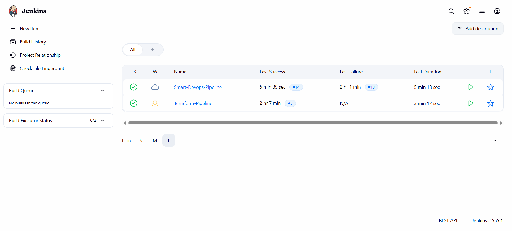

---

### Successful CI/CD Pipeline Execution


---

## ☸️ Kubernetes Cluster

### Kubernetes Pods


---

### Kubernetes Services

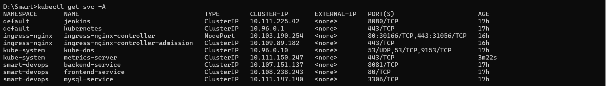

---

### Kubernetes Deployments

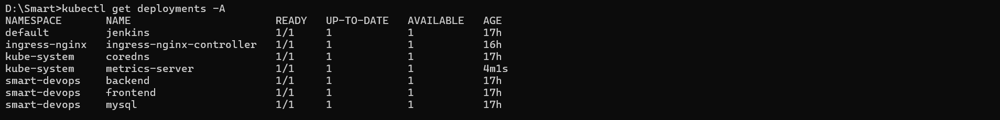

---

### Kubernetes Ingress

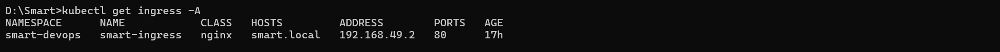

---

### Horizontal Pod Autoscaler (HPA)

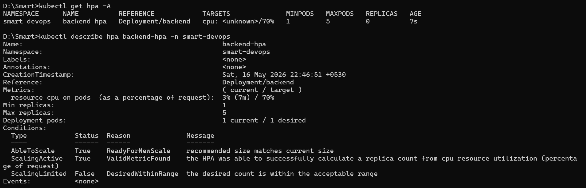

---

## 📊 Monitoring & Observability

### Grafana Dashboard


---

### JVM Monitoring Dashboard


---

### Kubernetes Metrics Dashboard


---

### Prometheus Targets

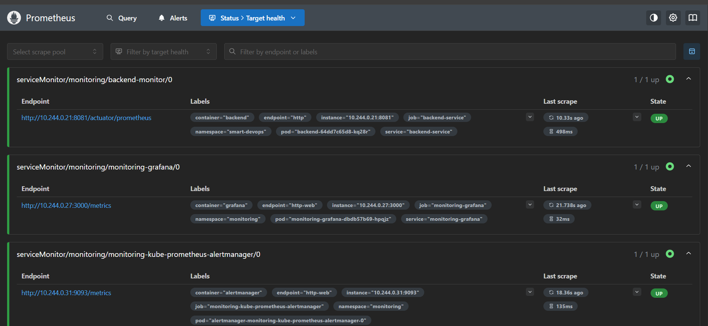

---

### Alertmanager


---

### Loki Logs

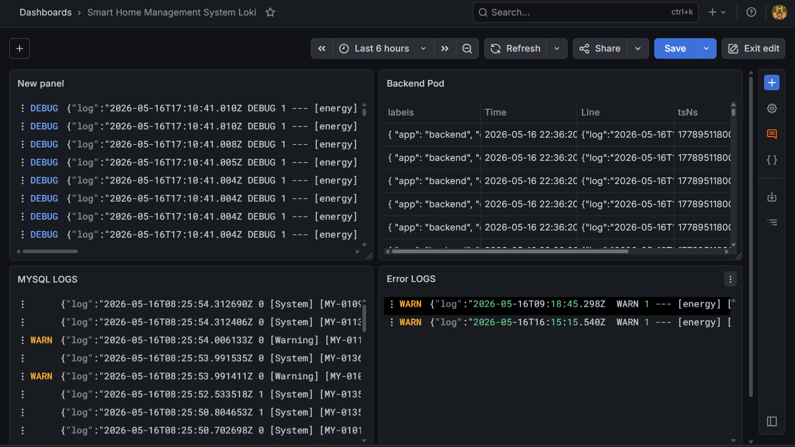

---

## 🔐 DevSecOps Security

### SonarQube Dashboard


---

### SonarQube Quality Gate


---

### OWASP Dependency Check Report

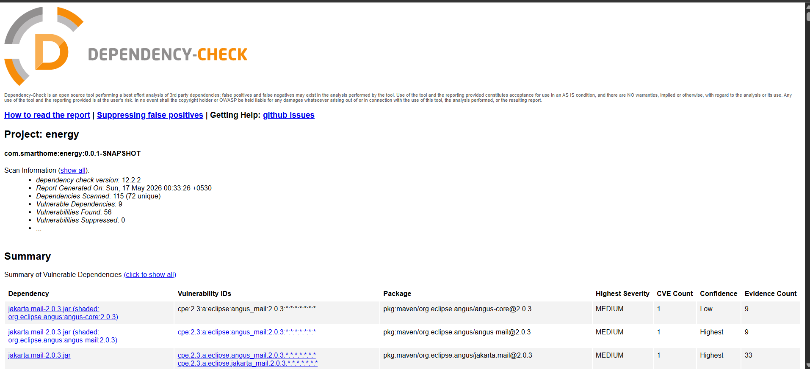

---

### Trivy Vulnerability Scan

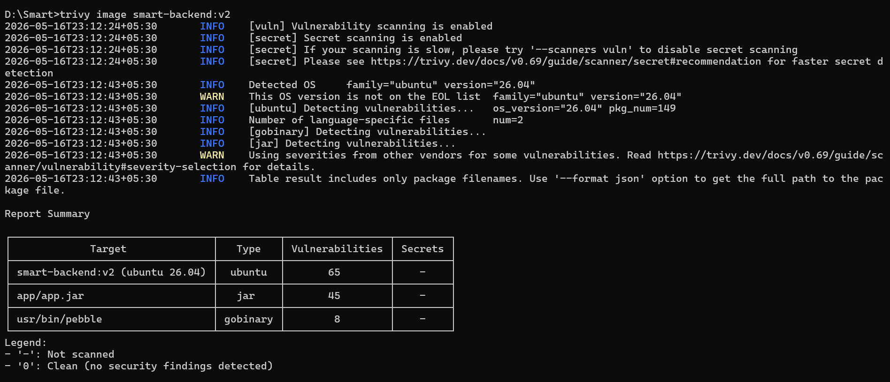

---

## ☁️ AWS Infrastructure & Terraform

### Terraform Plan


---

### Terraform Apply

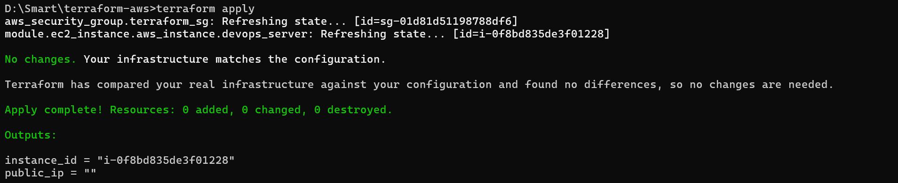

---

### AWS EC2 Instance


---

### AWS S3 Backend


---

### DynamoDB State Locking


---

## 🌐 Application UI

### Frontend Application

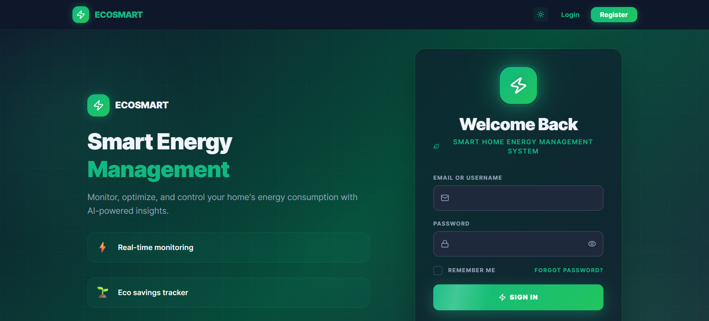

---

### Backend Health Endpoint

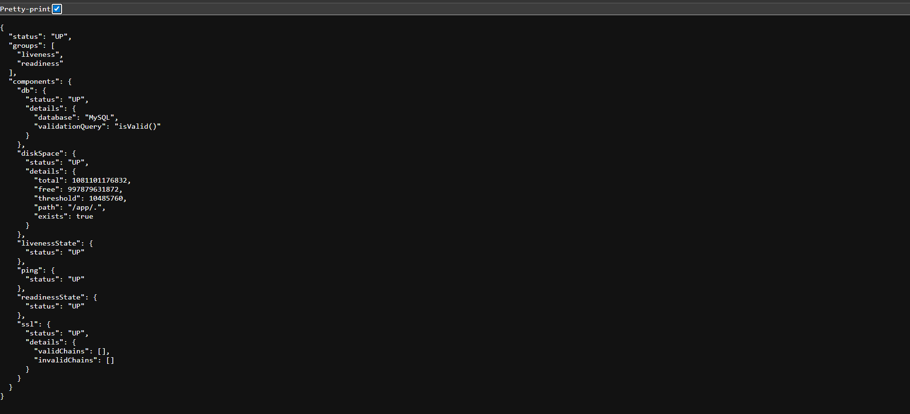

---
# 🚀 Deployment Guide
## 📦 Clone Repository

```bash
git clone https://github.com/YOUR_USERNAME/Smart.git
cd Smart
```

---

## 🐳 Start Docker

Ensure Docker Desktop is running before proceeding.

Verify Docker:

```bash
docker ps
```

---

## ☸️ Start Minikube

```bash
minikube start --driver=docker
```

Verify cluster:

```bash
kubectl get nodes
```

---

## 🚀 Enable Kubernetes Addons

```bash
minikube addons enable ingress
minikube addons enable metrics-server
```

## ☸️ Deploy Kubernetes Resources

```bash
kubectl apply -R -f kubernetes/
```

Verify workloads:

```bash
kubectl get pods -A
```

---

## 🌐 Access Frontend

```bash
kubectl port-forward svc/frontend-service 8081:80 -n smart-devops
```

Open:

```text
http://localhost:8081
```

---

## 🔍 Access Backend Health Endpoint

```bash
kubectl port-forward svc/backend-service 8085:8081 -n smart-devops
```

Open:

```text
http://localhost:8085/actuator/health
```

# 📊 Monitoring Setup

## 🚀 Install Monitoring Stack

```bash
helm repo add prometheus-community https://prometheus-community.github.io/helm-charts

helm repo update

kubectl create namespace monitoring

helm install monitoring prometheus-community/kube-prometheus-stack -n monitoring
```

---

## 📈 Access Grafana

```bash
kubectl port-forward -n monitoring svc/monitoring-grafana 3000:80
```

Open:

```text
http://localhost:3000
```

---

## 📉 Access Prometheus

```bash
kubectl port-forward -n monitoring svc/prometheus-operated 9091:9090
```

Open:

```text
http://localhost:9091
```

# 📝 Logging Setup

## 🚀 Install Loki Stack

```bash
helm repo add grafana https://grafana.github.io/helm-charts

helm repo update

helm install loki grafana/loki-stack -n monitoring
```

---

## 🔍 View Logs in Grafana

Open Grafana Explore and select Loki datasource.

Example LogQL query:

```logql
{namespace="smart-devops"}
```
